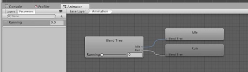
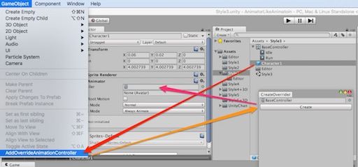

# AnimatorLikeAnimatoin

In my cases, Style2 and Style5 looks good.

##Style 1

style 1 is normal aniamtor style.
create animation controller in each sprite patterns.

Animation will indirectly operated by the parameter.

This style does not match for mass production. If the settings and adjustments to the animation is required, accompanied by a strong pain.
but, if you want if to create a unique character control, it might be a good.

##Style 2

Style 2 is using overrideanimationcontroller style.

This style use a animation contorller and some overrideanimationcontroller. it is useful for mass production characters.
but Not suitable for customization of each character.

In this example, in order to not clutter the animation clip in the project, AnimationController has stores AnimationClip.

1.  chose "add animationclip"
2.  type clipname and "add clip" button

###Stlye 2+

Style 2+ is using blend tree.
Control by the blend tree, might be useful than state machine. perhaps. maybe...
game by game.

##Style 3

Style 3 is using animation override controller but does not use asset.  
it serialise in scene.

This style has only a AnimationController and scene.

This style create a animation override controller in scene.

If using a single animation in stage (of scene), the method may be effective.

The problem is that you can not write the AnimationOverrideController that was created in the scene in the asset.
if you put a prefab to project view, Animation Override controller will be None.

If you want to create a prefab, you should create override controller to (project view’s) prefab.

1.  chose prefab (has animator)
2.  GameObject > AddOverride Animation Controller
3.  click Create button
4.  setting animator

##Style 4

Style 4 does not use the Animator state management.
If you want to manage animation by script, or you want to add extra animation clip, This style might be useful.

This approach to switch the animation clip at the time of animation switching.
you can add or change animation by scripts because it does not use a state machine.

it control by script.
if you want to change animation, you should write a code.

This style has 2 issue.

1.  It has cost of animation change.
2.  Initialize animator on change.

Especially, big issue is second issue. it means that can't use blend animation.
if you has just sprite animation, you don't care.

##Style 5

Style 5 is advanced type of style 4.
This style, uses the Style 3 and Style4. so get the AnimationController with the required count AnimationClips, then override the AnimationClip.

Style 5, like the Style4, controlled by the script. State machine does not use. 

This style fixed style 4's issues. so, it can use blend and it can change animation with low cost. 
but control are complex, and you should prepare many many animators.

