# AnimatorLikeAnimatoin

Animator (mecanim) are good system for animation. powerful retargeting, statemachien, and IK, support sprite animation.

But, unfortunately, some project does not match it.
 For example... If Animator has cancel animation, has many characters, has many animation clip ( want to play animation clip without complex gui setup), has very complex state machine, if you want to add animationcip in dynamic, and if you want to control animation by script.
Some project will match animator, but some project does not match. if you have unmatch projects, Animator makes pain.

In unmatch project,  If you can use legacy animation system, it might happy. but the legacy animation system un support 2d sprite and material animation. if you want to 2d animation, you should use animator.

This repositry looking for way to make the pain easier.

---

[日本語向けの記事はこちら](http://tsubakit1.hateblo.jp/entry/2016/05/16/073000)

if you want to use style 1 ~ 3,  you can learning how to use animator. In particular, I will recommend to learn how to use the sub-state to you. This will avoid the spaghetti.

-  [substatemachiene tutorial](https://www.youtube.com/watch?v=lpekqN4_4xg)
-  [Animation Blending with Mecanim](https://warzonegameblog.wordpress.com/2015/12/22/animation-blending-with-mecanim/)

## Style 1

style 1 is normal aniamtor style.
create animation controller in each sprite patterns.

Animation will indirectly operated by the parameter.

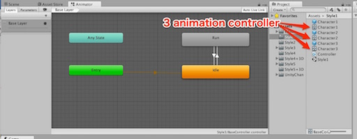

This style does not match for mass production. If the settings and adjustments to the animation is required, accompanied by a strong pain.
but, if you want if to create a unique character control, it might be a good.

## Style 2

Style 2 is using overrideanimationcontroller style.

This style, to create a AnimationController underlying using a dummy of AnimationClip, and set the AnimatinoClip for each character.

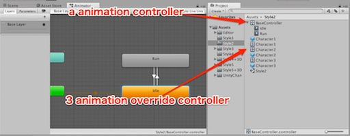

This style use a animation contorller and some overrideanimationcontroller. it is useful for mass production characters.
but Not suitable for customization of each character.

At first, you create a template animation controller. it can idle, run. and you can override animation clip for each characters. perhaps you can set automatically by naming rule. if you write editor extensions.

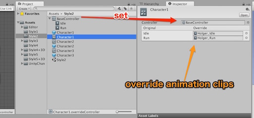

In this example, in order to not clutter the animation clip in the project, AnimationController has stores AnimationClip.

1.  chose "add animationclip"
2.  type clipname and "add clip" button

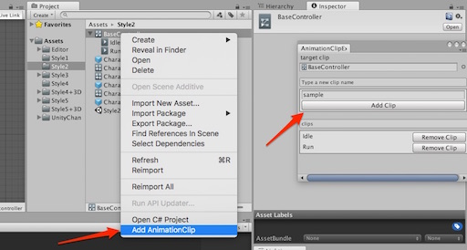

### Stlye 2+

Style 2+ is using blend tree.
Control by the blend tree, might be useful than state machine. perhaps. maybe...
game by game.

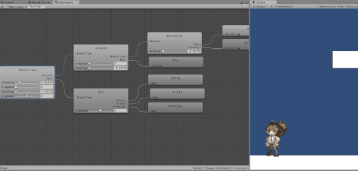

This style has a issue because poor of editor function.
The animator editor of BlendTree does not has copy & paste & replace function, search, move behaviour.
And blendTree does not controls other than float.

If you want to rework the animation of complex structures, you get a big pain.
But still it might be easier than the state machine.

## Style 3

Style 3 is using animation override controller but does not use asset.  
it serialise in scene.

This style has only a AnimationController and scene.

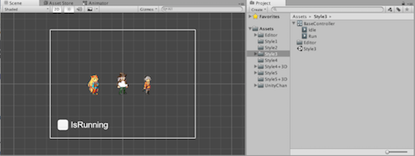

This style create a animation override controller in scene.

If using a single animation in stage (of scene), the method may be effective.

might, AnimationOverrideController does not save in scene if you change just only AnimationOverrideController settings.
move other object and save.

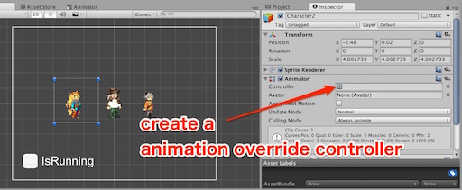

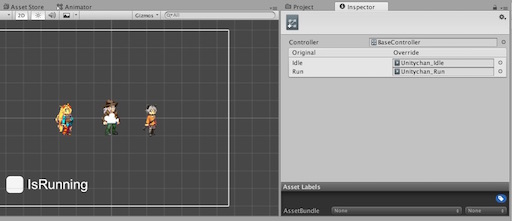

The problem is that you can not write the AnimationOverrideController that was created in the scene in the asset.
if you put a prefab to project view, Animation Override controller will be None.

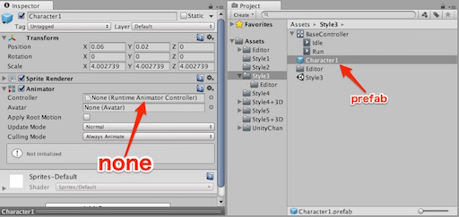

## Style 4

Style 4 does not use the Animator state management.
If you want to manage animation by script, or you want to add extra animation clip, This style might be useful.

This approach to switch the animation clip at the time of animation switching.
you can add or change animation by scripts because it does not use a state machine.

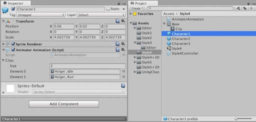

it control by script.
if you want to change animation, you should write a code.

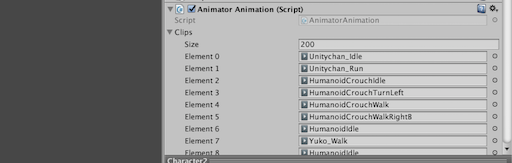

This style has 2 issue.

1.  It has cost of animation change.
2.  Initialize animator on change.

Especially, big issue is second issue. it means that can't use blend animation.
if you has just sprite animation, you don't care.

## Style 5

Style 5 is advanced type of style 4.
This style, uses the Style 3 and Style4. so get the AnimationController with the required count AnimationClips, then override the AnimationClip.

Style 5, like the Style4, controlled by the script. State machine does not use. 
You can Use the Animator.Play and Animator.Fade instead of clip switching. 

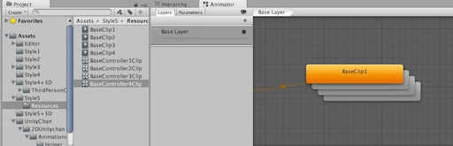

This style fixed style 4's issues. so, it can use blend and it can change animation with low cost. 
but control are complex.
If you want to go this approach, you should prepare AnimatorControllers same number with maximum clip count (need automatic!).

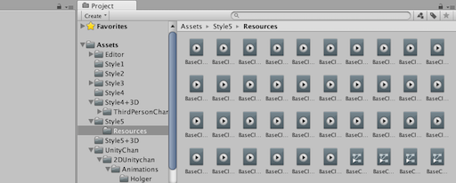

The problem is that you can not adjust the curve of the blend. If it is necessary, use the Style2 or Style1.
